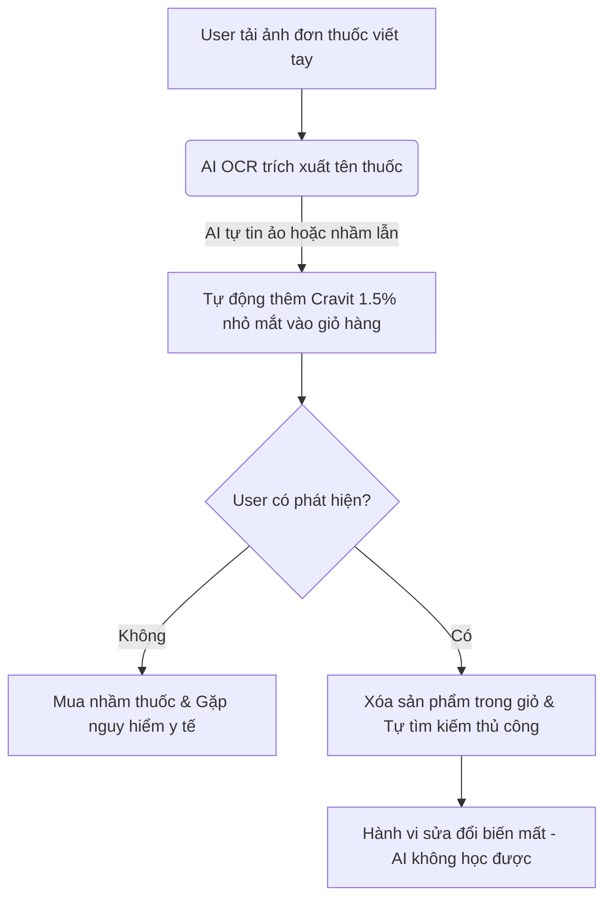
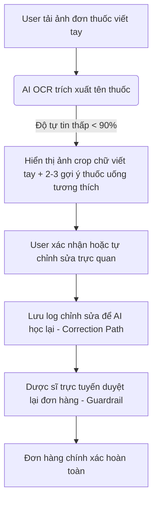

# Workshop — Mổ App AI Thật

**Thời gian:** 35-45 phút  
**Hình thức:** cá nhân trước, chia sẻ theo nhóm sau  
**Output:** finding note + sketch `as-is / to-be`

Mục tiêu không phải chấm "UI đẹp hay xấu". Mục tiêu là dùng sản phẩm thật như một bài needfinding: tìm chỗ product gãy trong workflow thật, rồi viết finding đó thành quyết định product.

## 1. Chọn một sản phẩm để dùng thử

| Sản phẩm | AI feature | Cách truy cập |
|---|---|---|
| Nhà thuốc Long Châu | Trích xuất đơn thuốc từ ảnh chụp để mua thuốc online | App Long Châu (Tính năng "Gửi đơn thuốc") |

## 2. Dùng thử: promise vs reality

Ghi nhanh:

- **Product hứa gì?**  
  Người dùng chỉ cần chụp và tải ảnh đơn thuốc của bác sĩ lên app, AI sẽ tự động phân tích đơn thuốc, trích xuất đúng tên thuốc, liều lượng và tự động thêm các sản phẩm tương ứng vào giỏ hàng để đặt mua ngay lập tức.
  
- **User nào được hứa sẽ được giúp?**  
  Bệnh nhân hoặc người nhà bệnh nhân sau khi đi khám về, có đơn thuốc giấy và muốn mua thuốc nhanh chóng mà không cần ra trực tiếp nhà thuốc hoặc tự gõ tìm kiếm từng loại thuốc phức tạp.

- **Bạn kỳ vọng AI làm được task nào?**  
  Nhận diện chính xác chữ viết (kể cả chữ viết tay của bác sĩ), phân tách đúng tên thuốc, biệt dược, hàm lượng (mg/ml) và số lượng cần mua.

- **Khi dùng thật, điểm gãy xuất hiện ở đâu?**  
  Chữ viết tay của bác sĩ lâm sàng thường cực kỳ cẩu thả, sử dụng nhiều ký hiệu viết tắt y tế khó hiểu (ví dụ: *1v x 2 (s-t)*, *p.c*, *a.c*). AI nhận diện sai hoàn toàn tên thuốc hoặc nhầm lẫn nghiêm trọng về hàm lượng (nhầm kháng sinh *Amoxicillin 500mg* thành *50mg* hoặc nhầm sang biệt dược khác có tên tương tự). Hệ thống không hiển thị cảnh báo về độ tin cậy thấp mà vẫn âm thầm đưa sản phẩm sai vào giỏ hàng hoặc báo lỗi hệ thống chung chung và chuyển hướng bắt buộc sang chat với dược sĩ sau thời gian chờ đợi lâu.

- **Evidence:**  
  - *Input thử nghiệm:* Tải lên ảnh đơn thuốc viết tay có ghi "Cravit 500mg x 5 viên, uống sáng 1v sau ăn".
  - *Hành vi quan sát:* App mất hơn 2 phút xử lý, sau đó tự động thêm vào giỏ hàng sản phẩm "Cravit 1.5% (nhỏ mắt)" thay vì thuốc uống Cravit 500mg do nhầm lẫn tên biệt dược. Không có cảnh báo y tế nào về sự khác biệt này được hiển thị rõ ràng trên màn hình giỏ hàng.

## 3. Vẽ 4 paths

| Path | Câu hỏi cần trả lời | Hiện trạng tại App Long Châu |
|---|---|---|
| **Happy** | Khi AI đúng và tự tin, user thấy gì? | Đơn thuốc in máy rõ ràng. Hệ thống trích xuất đúng, hiển thị danh sách thuốc kèm giá tiền và nút "Thanh toán" ngay lập tức. |
| **Low-confidence** | Khi AI không chắc, hệ thống có hỏi lại, show options hoặc chuyển người không? | App hiện tại **chưa có** path này. Khi AI không chắc chắn, nó vẫn tự động chọn một sản phẩm ngẫu nhiên gần giống nhất hoặc báo lỗi tải ảnh thất bại rồi bắt user đợi kết nối dược sĩ thủ công mà không giải thích gì thêm. |
| **Failure** | Khi AI sai, user biết bằng cách nào và sửa thế nào? | User chỉ phát hiện ra khi tự kiểm tra lại giỏ hàng (nếu họ có kiến thức y khoa hoặc nhớ đơn thuốc). Nếu không kiểm tra kỹ, họ sẽ mua nhầm thuốc. Cách sửa duy nhất là bấm xóa sản phẩm khỏi giỏ và tự tìm kiếm lại bằng tay. |
| **Correction** | Khi user sửa, correction có được lưu/log/học lại không hay biến mất? | Biến mất. Hành động xóa sản phẩm sai và thêm sản phẩm đúng của user chỉ được ghi nhận dưới dạng chỉnh sửa giỏ hàng thông thường, không được log lại để cải thiện mô hình OCR/AI trích xuất đơn thuốc lần sau. |

## 4. Viết finding thành quyết định

**Finding y khoa:**
Khi user tải ảnh đơn thuốc viết tay có chữ viết bác sĩ cẩu thả hoặc viết tắt chuyên môn, AI nhận dạng sai tên biệt dược hoặc dạng bào chế (ví dụ nhầm thuốc uống thành thuốc nhỏ mắt Cravit), hậu quả là người dùng mua và uống nhầm thuốc, gây nguy cơ ngộ độc hoặc không điều trị được bệnh. Lỗi thuộc layer **Data-tool (OCR/NLU) + UX Recovery**.

**Quyết định Product:**
Nên sửa bằng cách thiết kế **Low-confidence Path**: 
1. Nếu độ tin cậy nhận diện dưới 90%, hiển thị ảnh cắt (crop) vùng chữ y tế đó ngay cạnh bảng kết quả và yêu cầu user xác nhận: *"AI đang hiểu đây là Cravit 500mg uống, bạn có muốn sửa không?"*
2. Luôn có layer Dược sĩ trực tuyến duyệt lại đơn thuốc (Human-in-the-loop) trước khi đơn hàng được xác nhận giao đi.

## 5. Sketch as-is / to-be

### Flow As-Is (Hiện tại - Điểm gãy)

### Flow To-Be (Đề xuất sửa đổi)

## 6. Tự kiểm trước khi nộp

- [x] Có ít nhất 1 screenshot hoặc observation cụ thể.
- [x] Có đủ 4 paths hoặc nói rõ path nào chưa có trong product.
- [x] Finding được viết thành product decision, không chỉ là nhận xét.
- [x] Sketch có as-is và to-be (đã trực quan hóa bằng Mermaid).
- [x] Có một câu nói rõ finding này sẽ đổi gì trong SPEC.
  - *Ý nghĩa đối với SPEC:* Phát hiện này giúp nhóm quyết định loại bỏ hoàn toàn tính năng OCR ảnh đơn thuốc phức tạp ở phiên bản đầu tiên (vòng 1), thay vào đó chỉ nhận dữ liệu đầu vào là dạng **Text đơn thuốc (copy-paste)** và tập trung thiết kế UX hỗ trợ người dùng tự kiểm tra, xác nhận và sửa lỗi (Augmentation) cùng các cảnh báo y tế rõ ràng.
